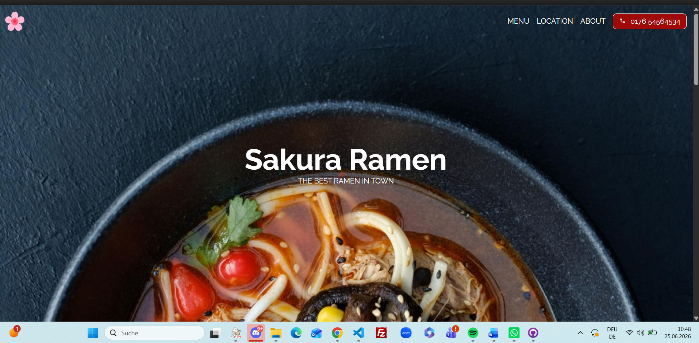
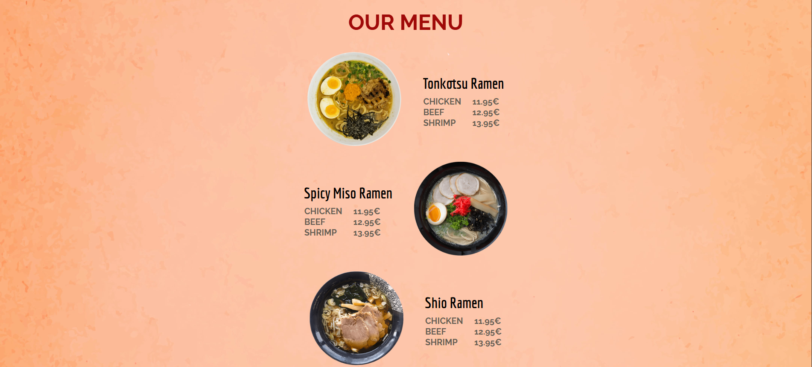
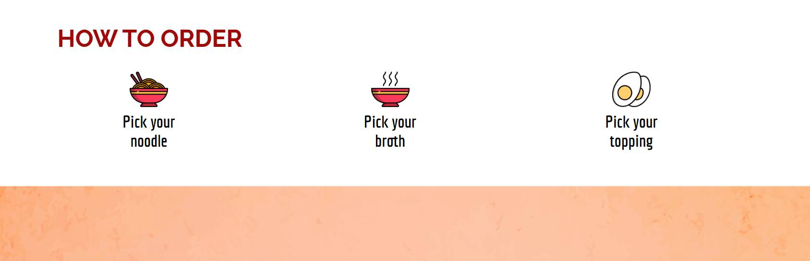
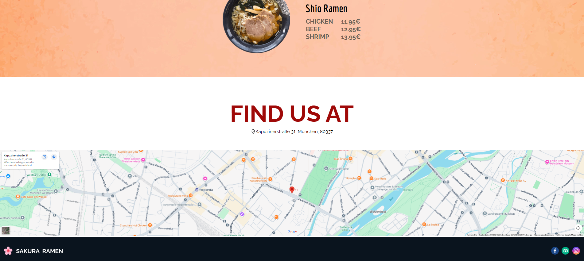

# 🍜 Sakura Ramen

Eine moderne und responsive Restaurant-Website, entwickelt mit HTML, CSS und JavaScript.

## 🌐 Live Demo

👉 https://janetbughardt.github.io/sakura-ramen/

## 📖 Projektbeschreibung

Dieses Projekt entstand als Webentwicklungsprojekt mit dem Ziel, eine moderne Restaurant-Website zu erstellen. Dabei lag der Fokus auf einem ansprechenden Design, einer benutzerfreundlichen Navigation und einer optimalen Darstellung auf Desktop-, Tablet- und Mobilgeräten.

## ✨ Funktionen

- Responsive Webdesign
- Modernes Layout
- Interaktive Navigation
- Optimiert für Desktop, Tablet und Smartphone
- Sauber strukturierter HTML-, CSS

## 🛠️ Verwendete Technologien

- HTML5
- CSS3

## 📷 Screenshots

### Homepage

### Menü

### Bestellung

### Find Us

## 👩‍💻 Entwickelt von

Janet Burghardt
